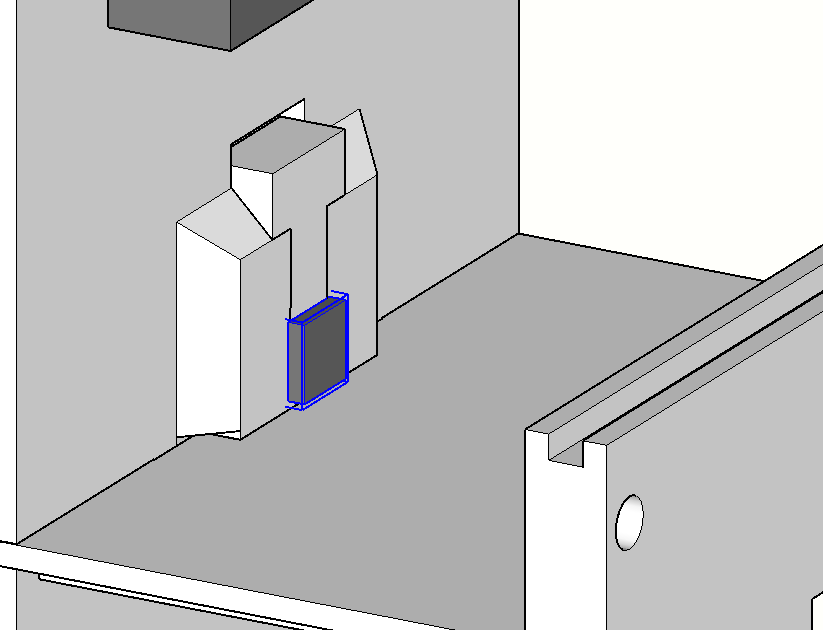
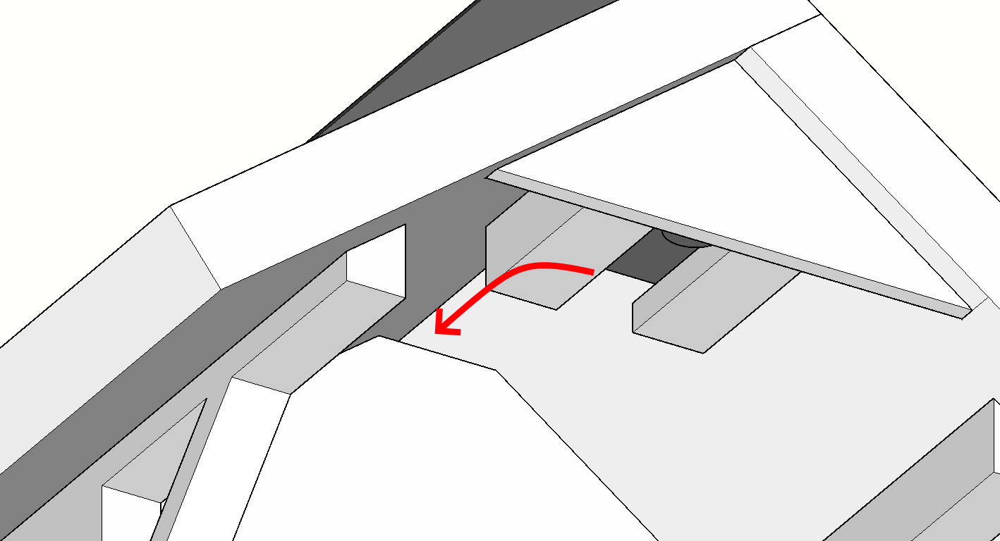

    

`⚠️ Dieses Projekt befindet sich zurzeit noch in der Prototyp-Phase. Der Prototyp ist funktionstüchtig, jedoch gibt es noch viel zu verbessern, damit das Gerät tatsächlich einen einsetzbaren Zustand erreicht. ⚠️`

<!-- omit in toc -->
# Inhaltsverzeichnis

- [Vogelfutterautomat](#vogelfutterautomat)
  - [Funktionsweise](#funktionsweise)
  - [Repository-Übersicht](#repository-übersicht)
  - [Materialübersicht](#materialübersicht)
  - [Anleitung](#anleitung)
    - [Firmware](#firmware)
      - [Arduino Pro Mini 3V](#arduino-pro-mini-3v)
      - [Seeed Studio XIAO ESP32S3 Sense](#seeed-studio-xiao-esp32s3-sense)
    - [Server](#server)
    - [Elektronik](#elektronik)
    - [Gehäuse](#gehäuse)
      - [Merkmale](#merkmale)
      - [Zusammenbau](#zusammenbau)

# Vogelfutterautomat

Bei diesem Projekt handelt es sich um einen Vogelfutterautomat mit integrierter Kamera und Mikrofon zur automatischen Durchführung von Bild- und Audioaufnahmen von Vögeln. Das Gerät kann die gesammelten Daten per WLAN an ein externes System übertragen oder diese auf einer SD-Karte speichern.

## Funktionsweise

Das Gerät basiert auf der Kombination eines Arduino Pro Mini und einem Seeed Studio XIAO ESP32S3 Sense. Als Stromversorgung dient ein Li-Po-Akku in Kombination mit einer Solarzelle und dem Solar Power Manager Board von DFRobot.

Der ESP32S3 führt mithilfe eines OV2640 Kamera-Moduls und dem integrierten Mikrofon Aufnahmen durch. Um den Stromverbrauch zu verringern wird die Stromversorgung des ESP32S3 durch den Arduino Pro Mini gesteuert. Der Arduino Pro Mini befindet sich dabei die meiste Zeit im Stromsparenden Deep-Sleep-Modus und wird mithilfe eines DS3231 Real-Time-Clock-Moduls sowie einem M5Stack AS312 PIR Bewegungssensor aufgeweckt.

Die Elektronik ist also wie folgt aufgebaut:

    

Je nach Firmware-Konfiguration werden bei jeder Aufweckung Foto- und Audio-Aufnahmen durch den ESP32S3 erhoben. Die Daten können dann entweder auf einer SD-Karte gespeichert oder per WLAN an einen dafür eingerichteten Webserver übertragen werden.

## Repository-Übersicht

* Arduino: Firmware für den Arduino Pro Mini 3V
* ESP: Firmware für den Seeed Studio XIAO ESP32S3 Sense
* Elektronik: Zeichnung des Schaltkreises.
* Bilder: Enthält die in diesem Dokument verwendeten Bilder
* Gehäuse: STL- und Sketchup-Dateien für den 3D-Druck des Gehäuses
* Server: Software für den PHP-Server

## Materialübersicht

Das gesamte für den Zusammenbau benötigte Material (mit beispielhaften Links wo angebracht):

* Arduino Pro Mini 3V ([Berrybase](https://www.berrybase.de/arduino-pro-mini-328-3.3v/8mhz))
* Seeed Studio XIAO ESP32S3 Sense ([Berrybase](https://www.berrybase.de/seeed-xiao-esp32s3-sense-esp32-s3r8-wlan-ble-5.0-ov2640-kamerasensor-8mb-psram-8mb-flash))
* DS3231 Real-Time-Clock-Modul ([Eckstein-Shop](https://eckstein-shop.de/DS3231RTCModulI2CAT24C32forArduino2CwithLIR2032BatteryEN))
* PIR Modul ([Robotshop](https://eu.robotshop.com/de/products/m5stack-pir-bewegungssensor-as312))
* DFRobot Solar Power Manager ([Eckstein-Shop](https://eckstein-shop.de/DFRobotSolarPowerManager5VEN))
* Li-Po Akku
* Solarzelle
* OV2640 mit langem Ribbon-Cable und Weitwinkellinse ([Amazon](https://amazon.de/dp/B0BXSL76L8))
* 6x M3-Schraube sowie Mutter für die Fixierung des Gehäuses
* 4x M2-Schraube sowie Mutter für die Befestigung der Platine im Gehäuse
* Lochraster-Platine (70 x 50 mm) ([Eckstein-Shop](https://eckstein-shop.de/Lochrasterplatine50x70mmExperimentierplatineLC3B6tplatinePrototypeLeiterplattePCB2StC3BCcke))
* Lötmaterial (Platine, Verbindungskabel, Stiftleisten)

## Anleitung

### Firmware

Für das Anpassen und Überspielen der Firmware auf die beiden Mikroprozessor-Boards wird die [Arduino IDE](https://www.arduino.cc/en/software) benötigt. Als Einführung hier die offizielle (englische) Anleitung: [Link](https://docs.arduino.cc/software/ide-v2/tutorials/getting-started-ide-v2/)

Es werden für die Kompilierung die folgenden Bibliotheken benötigt, die zuvor über die Arduino IDE installiert werden müssen:

* [Low-Power (Rocket Scream Electronics)](https://www.arduino.cc/reference/en/libraries/low-power/): Verwaltung des Deep-Sleep-Modus für den Arduino Pro Mini 3V
* [RTCLib (Adafruit)](https://www.arduino.cc/reference/en/libraries/rtclib/): Kommunikation mit dem DS3231 Real-Time-Clock-Modul via I2C auf dem ESP32S3
* [NTPClient (Fabrice Weinberg)](https://www.arduino.cc/reference/en/libraries/ntpclient/): Für die Ermittlung der Uhrzeit via WLAN für das DS3231 Real-Time-Clock-Modul

#### Arduino Pro Mini 3V

Die Firmware für den Arduino Pro Mini befindet sich unter `Arduino/Arduino.ino`. Es sind hier keine Anpassungen am Quellcode notwendig.

Es ist jedoch wichtig zu beachten, dass vor dem Überspielen in der Arduino IDE unter "Werkzeuge" > "Processor" der Wert "ATmega328P (3,3V, 8 MHz)" ausgewählt wird (anstelle der 5V Variante):

#### Seeed Studio XIAO ESP32S3 Sense

Die Firmware für den Seeed Studio XIAO ESP32S3 Sense befindet sich unter `ESP/ESP.ino`. Im Quellcode können die folgenden Einstellungen vorgenommen werden:

| Einstellung | Beschreibung | Beispiel |
| ----------- | ------------ | ------------ |
| `SERIAL_DEBUG` | Kann für Debug-Zwecke definiert werden, um Informationen über die UART-Schnittstelle des ESP32S3 ausgeben zu lassen | `//#define SERIAL_DEBUG` (deaktiviert) |
| `DATEN_MODUS` | Bestimmt, wie die mit den gesammelten Daten umgegangen wird. `DIREKT_UPLOAD`: Daten werden sofort bei Aufnahme hochgeladen und nicht zwischengespeichert. In diesem Modus wird keine SD-Karte benötigt. `TAEGLICHER_UPLOAD`: Aufnahmen werden auf der SD-Karte zwischengespeichert und am nächsten Morgen hochgeladen. `LOKAL`: Aufnahmen werden nur auf der SD-Karte gespeichert; die WLAN-Funktion wird hierbei dennoch eventuell für die Ermittlung der Uhrzeit verwendet, falls das RTC-Modul ausfällt. | `#define DATEN_MODUS DIREKT_UPLOAD` |
| `WARTE_VOR_FOTO` | Gibt eine Zeit (in Sekunden) an, die zwischen hochfahren und Foto gewartet werden soll. Dies dient dazu, dass sich der Kamera-Sensor an die Helligkeit der Umgebung anpassen kann, um unter-/überbelichteten Fotos vorzubeugen. | `#define WARTE_VOR_FOTO 2` |
| `AUDIOAUFNAHME_KURZ_DAUER` | Bestimmt die Länge der Audioaufnahme (in Sekunden) bei Aufweckung durch den Bewegungssensor. Maximalwert: 240 Sekunden. | `#define AUDIOAUFNAHME_KURZ_DAUER 5` |
| `AUDIOAUFNAHME_LANG_DAUER` | Bestimmt die Länge der Audioaufnahme (in Sekunden) bei Aufweckung durch das Real-Time-Clock-Modul. Dies dient dazu, den Vogelgesang am Morgen festzuhalten. Maximalwert: 240 Sekunden. | `#define AUDIOAUFNAHME_LANG_DAUER 60` |
| `WIFI_SSID` | Der Name des WLAN-Netzwerkes. | `#define WIFI_SSID "MeinWLAN"` |
| `WIFI_PASSWORD` | Das Passwort des WLAN-Netzwerkes. | `#define WIFI_PASSWORD "MeinPasswort"` |
| `UPLOAD_SERVER` | Die IP-Adresse des Webservers. | `#define UPLOAD_SERVER "192.168.178.50"` |
| `UPLOAD_PORT` | Der vom Webserver verwendete Port. Normalerweise ist dies bei HTTP der Port 80. | `#define UPLOAD_PORT 80` |
| `UPLOAD_PATH` | Der Pfad zum `upload.php`-Skript auf dem Webserver. Bei Ablage im Root-Verzeichnis lautet dieser `/upload.php` | `#define UPLOAD_PATH "/upload.php"` |

Vor dem Überspielen der Firmware muss unter "Werkzeuge" > "PSRAM" der Wert "OPI PSRAM" ausgewählt werden:

### Server

Die Server-Seite verwendet HTML & PHP. Dafür muss eine entsprechende Server-Software auf einem geeigneten Gerät installiert werden. Das verwendete Gerät sollte soweit möglich durchgehend erreichbar sein, damit jederzeit Uploads stattfinden können. Es wird daher empfohlen, dafür zum Beispiel einen Raspberry Pi oder einen Mini-PC zu verwenden.

Um die Server-Seite zu hosten wird Apache & PHP verwendet. Die Installation dieser Komponenten hängt vom Betriebssystem ab:

* Unter Windows kann [XAMPP](https://www.apachefriends.org/de/index.html) verwendet werden.
* Für eine Anleitung zur Installation von Apache & PHP unter Linux sollte je nach Distribution nach einer Anleitung gesucht werden. Beispielsweise hier die [Installation unter Ubuntu](https://wiki.ubuntuusers.de/PHP/#Installation-fuer-serverseitige-Programmierung).

Nach der Installation können die Dateien aus dem "Server"-Verzeichnis dieses Repositories im entsprechenden Root-Verzeichnis des Webservers abgelegt werden: unter Windows der Ordner `Apache\htdocs`, unter Linux standardmäßig `/var/www/html`. Falls die Dateien in einem Unterverzeichnis abgelegt werden (zum Beispiel weil bereits andere Webseiten gehostet werden) muss der entsprechende Pfad in der `ESP.ino` eingetragen werden.

In dem Verzeichnis befinden sich auch zwei Log-Dateien `log.txt` und `errors.txt`. In diese Textdateien werden nach jedem erfolgten Upload rudimentäre Informationen festgehalten um potentielle Probleme zu diagnostizieren.

Damit die Webseite durch den ESP32S3 gefunden werden kann muss die IP-Adresse in der `ESP.ino` eingetragen werden (unter `#define UPLOAD_SERVER`).

* Anleitung für Windows [hier](https://support.microsoft.com/de-de/windows/suchen-sie-ihre-ip-adresse-in-windows-f21a9bbc-c582-55cd-35e0-73431160a1b9)
* Anleitung für Linux [hier](https://www.ionos.de/digitalguide/hosting/hosting-technik/linux-ip-adresse-anzeigen/)

### Elektronik

Der Schaltplan der Platine ist im Verzeichnis `Elektronik` zu finden. Die `.fzz`-Datei kann mit der Software [Fritzing](https://fritzing.org/) eingesehen werden. Bei Fritzing handelt es sich zwar um Open-Source Software, jedoch wird die kompilierte Version nur gegen Zahlung vertrieben. Falls die Software also nicht verwendet werden kann, finden Sie hier einen Screenshot des Schaltplans:

Dabei wurden für die Anschlüsse mit der Bezeichnung `-/A/+ PIR` (oben links) einfache Stiftleisten verwendet. Für `-/+ PWR` (oben links) wurden Schraubklemmen gewählt. Das RTC-Modul (rechts) wurde mit 90° gebogenen Stiften versehen und deshalb auch mit 90°-Winkel Stiftleisten auf der Platine befestigt.

Die fertiggestellte Platine inklusive der einzelnen Komponenten sieht Schlußendlich wie folgt aus:

### Gehäuse

Die Modell-Dateien für das Gehäuse können im Verzeichnis `Gehäuse` gefunden werden.

Das Gehäuse wurde für die Herstellung mittels 3D-Druck konzipiert. Neben den einzelnen Bauteilen im `STL`-Dateiformat wurde auch das komplette Modell als [Sketchup](https://www.sketchup.com/)-Datei (`SKP`-Dateiformat) hinterlegt. Dadurch können eigene Anpassungen durchgeführt werden, soweit dies erforderlich ist.

    

In der Sketchup-Datei wurden auch die restlichen Komponenten, wie beispielsweise die Solarzelle und das Kamera-Modul, eingezeichnet. Falls sich diese Maße von denen Ihrer Komponenten unterscheided, was beispielsweise bei der gelöteten Platine der Fall sein kann, müssen eventuell hier Anpassungen durchgeführt werden.

Falls kein eigener 3D-Drucker zur Verfügung steht kann die Produktion des Gehäuses auch durch einen Dienstleister durchgeführt werden lassen. Dazu reicht es aus, die `STL`-Dateien an diesen zu übergeben.

Bei der eigenen Herstellung sollte darauf geachtet werden, ob es möglich ist, ein Hitzebeständigeres Material als PLA zu verwenden, da dieses eventuell unter intensiver Sonneneinstrahlung die Erweichungstemperatur erreicht. Empfohlen wird hier der Druck mittels PETG-Filament. Die Druckzeit unterscheided sich je nach Drucker, Filament und Konfiguration immens. Ein Testdruck, der auf einem Prusa I3 MK3S+ mit PETG-Filament durchgeführt wurde, dauerte insgesamt circa 45 Stunden.

Fast alle Bauteile des Gehäuses werden per Steckverbindung zusammengefügt. Dabei kann die Toleranz dieser Verbindungen jedoch nicht im Allgemeinen für jeden Drucker korrekt in den gebotenen Modell-Dateien geboten werden. Daher wird es sehr wahrscheinlich notwendig sein, die einzelnen Steckverbindungen mit Feile oder anderen Schleifmethoden nachzubearbeiten, bis die Steckverbindungen der Bauteile zusammenpassen.

#### Merkmale

Die Solarzelle kann beliebig links oder rechts auf dem Dach platziert werden. Das Verbindungskabel wird dann über die Rückseite durch eine Öffnung direkt unterhalb des Daches in die innere Kammer geführt:

    

Der PIR-Bewegungssensor wurde unter dem Dach platziert und nach unten auf den Futtertrog ausgerichtet. Die Kabel des Sensors werden unter dem Dach durch eine Öffnung ins Innere geführt:

    

Die Linse des OV2640-Kamera-Moduls wird auf der Vorderseite des Gehäuse platziert. Diese wird von oben in einen Schlitz eingeführt, um die Linse zu fixieren:

    

Die restliche Elektronik wurde im inneren des Gehäuses platziert. Der Li-Po Akku (links) wird mit doppelseitigem Klebeband über der Kamera an der Vorderwand fixiert. Das DFRobot Solar Power Manager Board wird ohne fixierung im unteren Bereich abgelegt. Die Platine mit den restlichen Komponenten (rechts) wird gegenüber der Kamera mittels 4 M2 Schrauben und Muttern an der Rückwand befestigt.

    

Auf der Rückseite des Gehäuse befindet sich eine Öffnung, um Vogelfutter nachzufüllen. Zudem befinden sich hier zwei Öffnungen, durch die der Vogelfutterautomat mittels Schrauben an einer Hauswand befestigt werden.

    

#### Zusammenbau

Der Zusammenbau des Gehäuses ist weitestgehend selbsterklärend. Zunächst wird der Li-Po Akku mit doppelseitigem Klebeband an der Rückseite der Vorderwand befestigt. Dabei sollte darauf geachtet werden, dass das Kabel des Akkus nach unten ausgerichtet ist.

    

Vom Futtertrog ausgehend werden die Vorderwand, der untere Teil der Rückwand und der Kammer-Separator zusammengesteckt:

    

Das Dach wird dann zunächst separat inklusive der PIR-Sensorhalterung zusammengesteckt:

    

Die Elektronik wird an der noch separierten oberen Rückwand mittels 4 M2 Schrauben und Muttern befestigt:

    

Das Kamera-Modul wird dann von oben in die dafür vorgesehene Halterung in der Vorderwand eingeführt. Eventuell muss hierfür die Linse etwas verstellt werden:

    

Das Solar Power Manager Board wird dann im Inneren der Kammer platziert und zunächst nur mit dem Li-Po Akku verbunden:

    

Nun wird der obere Teil der Rückwand inklusive der Platine sowie eine der Seitenwände angesteckt. Die Seitenwand wird dann mit 3 M3 Schrauben und Muttern an den beiden Teilen der Rückwand fixiert. Dazu wird zunächst jeweils eine M3 Mutter in die dafür vorgesehenen rechteckigen Öffnungen auf den Seitenwänden gepresst, sodass diese nicht mehr rotieren kann. Dann kann durch die Rückwand hindurch jeweils eine M3 Schraube in jede Mutter eingeführt und fixiert werden:

    

Nun kann die Stromversorgung des Solar Power Manager Boards mit der Platine verbunden werden. Zudem wird auch das Kamera-Modul an den XIAO ESP32S3 Sense angeschlossen.

    

Ohne das Dach bereits aufzustecken wird nun der Anschluss der Solarzelle durch die obere Öffnung der Rückwand geführt und an das Solar Power Manager Board angeschlossen. Zudem wird die Verkabelung des PIR-Bewegungsmelders mit der Platine durchgeführt. Falls dies in der Konfiguration der Firmware vorgesehen ist, wird in diesem Schritt auch die SD-Karte in den SD-Kartenleser des XIAO ESP32S3 Sense gesteckt. Jetzt kann die zweite Seitenwand angebracht werden. Diese wird ebenfalls durch 3 M3 Schrauben und Muttern an der Rückwand befestigt.

    

Im letzten Schritt wird das Dach auf der Oberseite des Gerätes aufgesteckt. Hierbei muss darauf geachtet werden, dass die Kabel des PIR-Bewegungsmelder über die Flache Kante der Vorderwand von Außen in die innere Kammer geführt wurden, ohne dass diese durch das Dach gequetscht werden.

    

Der PIR-Bewegungssensor wird dann in der dafür vorgesehenen Halterung an der Unterseite des Daches befestigt. Die Solarzelle wird auf der Seite des Daches platziert. Damit ist der Zusammenbau abgeschlossen.

    

